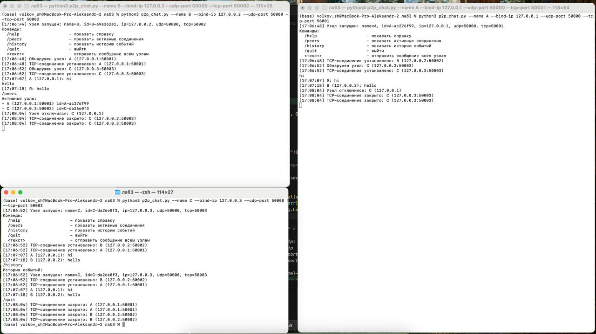
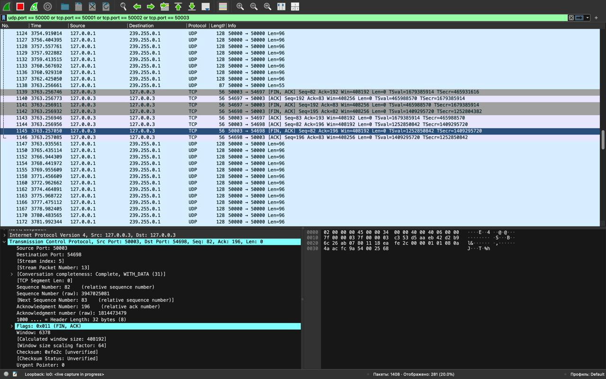

# Министерство образования
Учреждение образования
«Белорусский государственный университет информатики и
радиоэлектроники»

Специальность «Программная инженерия»
Кафедра программного обеспечения информационных технологий
Учебная дисциплина «Компьютерные системы и сети»

## ОТЧЁТ
по лабораторной работе №3
«P2P чат»

**Выполнил:** Волков А. С.

**Проверила:** Болтак С. В.

Минск 2026

---

## Цель работы

Разработать программу для обмена текстовыми сообщениями между двумя и более компьютерами в локальной сети в одноранговом режиме с использованием Socket API (WebSocket не использовать).

---

## Ввод IP и портов (не хардкод)

Параметры задаются через аргументы командной строки (`--name`, `--bind-ip`, `--udp-port`, `--tcp-port`) или интерактивно при запуске.

## Проверка доступности портов

При запуске узел делает `bind()` на UDP и TCP сокеты. Если порт занят или адрес недоступен, программа выводит ошибку и завершает работу.

## Неблокирующий UI

Ввод пользователя остаётся в главном потоке (`input()`), а сеть работает в фоновых потоках:

- отдельный поток для приёма UDP discovery;
- отдельный поток для `accept()` TCP;
- отдельный поток на каждого TCP-пира для чтения входящих сообщений.

## История событий

Все события записываются и выводятся с отметкой времени:

- запуск узла;
- обнаружение нового узла;
- установка/закрытие TCP-соединения;
- входящие сообщения;
- собственные отправленные сообщения;
- отключение узла (через UDP leave и/или закрытие TCP).

## Имя пользователя и IP/порты задаются пользователем

- `parse_args()`, `ask_if_missing()` — ввод параметров.

## UDP broadcast discovery

- `send_discovery_broadcast()` — отправка UDP discovery‑пакета со своим именем.
- `udp_discovery_loop()` — приём discovery и подключение по TCP к узлу.

Для теста на одном компьютере (адреса `127.0.0.x`) используется UDP multicast (группа `239.255.0.1`), т.к. при `SO_REUSEPORT` broadcast/UDP пакеты могут распределяться между процессами и discovery работает нестабильно. Для обычной сети используется UDP broadcast.

## TCP соединения между узлами и обмен именами

- `start_tcp_server()`, `accept_loop()` — приём входящих TCP соединений.
- `connect_to_peer()` — исходящее TCP подключение.
- `MSG_HELLO`, `send_frame()`, `recv_frame()`, `handle_hello()` — передача/приём имени и идентификатора узла.

## Отправка сообщений всем узлам

- `send_chat()` — формирование сообщения и отправка всем TCP пирам.

## Корректная обработка отключения

- при завершении работы отправляется UDP `leave` (`send_leave_broadcast()`), другие узлы пишут событие отключения;
- при обрыве TCP соединения в `peer_reader_loop()` выполняется `close_peer()`.

## UI не блокируется

- сетевые функции запускаются в `threading.Thread(..., daemon=True)`.

---

## Тестирование (один Mac, 3 узла через loopback)

Тест выполнялся на одном компьютере в трёх терминалах, используя loopback‑адреса `127.0.0.x`.

### Команды запуска

    python3 p2p_chat.py --name A --bind-ip 127.0.0.1 --udp-port 50000 --tcp-port 50001
    python3 p2p_chat.py --name B --bind-ip 127.0.0.2 --udp-port 50000 --tcp-port 50002
    python3 p2p_chat.py --name C --bind-ip 127.0.0.3 --udp-port 50000 --tcp-port 50003

---

**Рисунок 1 – результат работы чата (macOS)**

---

**Рисунок 2 – трафик в Wireshark (UDP discovery + TCP сообщения)**  
Фильтр отображения: `udp.port == 50000 or tcp.port == 50001 or tcp.port == 50002 or tcp.port == 50003`.

---

## Вывод

В ходе работы реализован одноранговый чат на Socket API: обнаружение узлов через UDP discovery и обмен сообщениями через TCP. Узлы идентифицируются именем и IP, параметры IP/портов задаются пользователем, при запуске проверяется возможность `bind` на выбранные порты. Пользовательский ввод не блокируется сетевой работой благодаря использованию потоков. Ведётся история событий с отметками времени.
