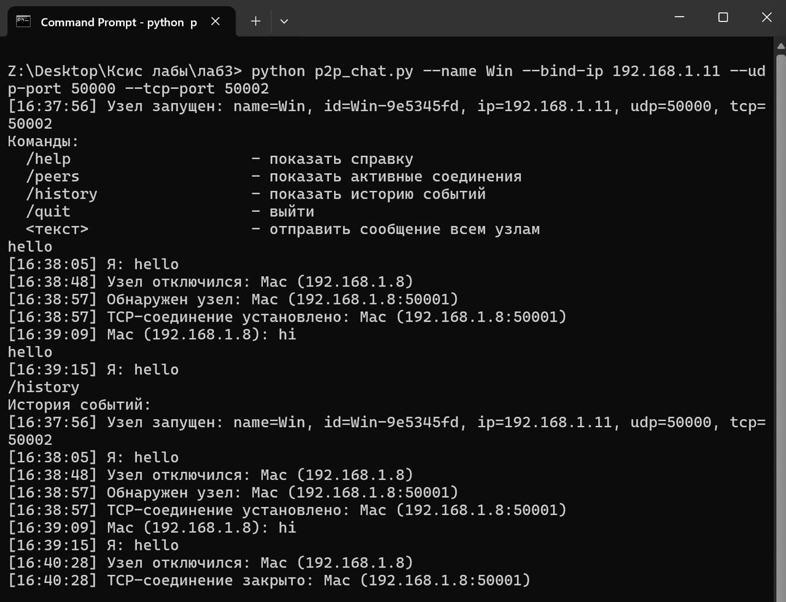
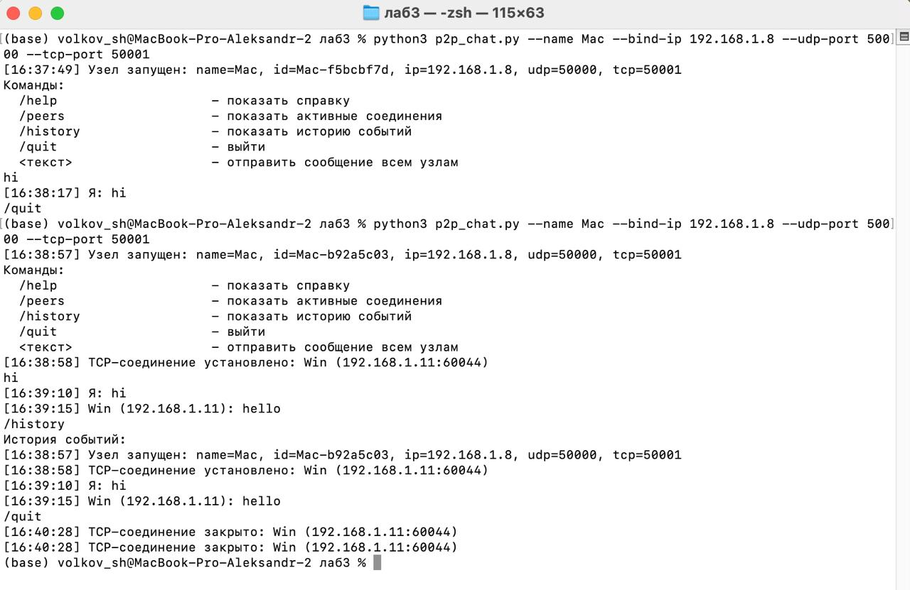

# Министерство образования
Учреждение образования
«Белорусский государственный университет информатики и
радиоэлектроники»

Специальность «Программная инженерия»
Кафедра программного обеспечения информационных технологий
Учебная дисциплина «Компьютерные системы и сети»

## ОТЧЁТ
по лабораторной работе №3
«P2P чат»

**Выполнил:** Волков А. С.

**Проверила:** Болтак С. В.

Минск 2026

---

## Цель работы

Разработать программу для обмена текстовыми сообщениями между двумя и более компьютерами в локальной сети в одноранговом режиме с использованием Socket API (WebSocket не использовать).

---

## Ввод IP и портов (не хардкод)

Параметры задаются через аргументы командной строки (`--name`, `--bind-ip`, `--udp-port`, `--tcp-port`) или интерактивно при запуске.

## Проверка доступности портов

При запуске узел делает `bind()` на UDP и TCP сокеты. Если порт занят или адрес недоступен, программа выводит ошибку и завершает работу.

## Неблокирующий UI

Ввод пользователя остаётся в главном потоке (`input()`), а сеть работает в фоновых потоках:

- отдельный поток для приёма UDP discovery;
- отдельный поток для `accept()` TCP;
- отдельный поток на каждого TCP-пира для чтения входящих сообщений.

## История событий

Все события записываются и выводятся с отметкой времени:

- запуск узла;
- обнаружение нового узла;
- установка/закрытие TCP-соединения;
- входящие сообщения;
- собственные отправленные сообщения;
- отключение узла (через UDP leave и/или закрытие TCP).

## Имя пользователя и IP/порты задаются пользователем

- `parse_args()`, `ask_if_missing()` — ввод параметров.

## UDP broadcast discovery

- `send_discovery_broadcast()` — отправка широковещательного UDP-пакета со своим именем.
- `udp_discovery_loop()` — приём broadcast и подключение по TCP к отправителю.

## TCP соединения между узлами и обмен именами

- `start_tcp_server()`, `accept_loop()` — приём входящих TCP соединений.
- `connect_to_peer()` — исходящее TCP подключение.
- `MSG_HELLO`, `send_frame()`, `recv_frame()`, `handle_hello()` — передача/приём имени и идентификатора узла.

## Отправка сообщений всем узлам

- `send_chat()` — формирование сообщения и отправка всем TCP пирам.

## Корректная обработка отключения

- при завершении работы отправляется UDP `leave` (`send_leave_broadcast()`), другие узлы пишут событие отключения;
- при обрыве TCP соединения в `peer_reader_loop()` выполняется `close_peer()`.

## UI не блокируется

- сетевые функции запускаются в `threading.Thread(..., daemon=True)`.

---

## Тестирование (macOS + Windows VM)

Тест выполнялся между macOS и Windows VM (Parallels) в одной сети.

### Настройка сети

- В Parallels Desktop для Windows VM выбран режим **Bridged**.

### IP-адреса

- macOS: `192.168.1.8`
- Windows VM: `192.168.1.11`

### Команды запуска

macOS:

    python3 p2p_chat.py --name Mac --bind-ip 192.168.1.8 --udp-port 50000 --tcp-port 50001

Windows:

    python p2p_chat.py --name Win --bind-ip 192.168.1.11 --udp-port 50000 --tcp-port 50002

---

**Рисунок 1 – результат работы чата (Windows)**

**Рисунок 2 – результат работы чата (MacOS)**

---

## Вывод

В ходе работы реализован одноранговый чат на Socket API: обнаружение узлов через UDP broadcast и обмен сообщениями через TCP. Узлы идентифицируются именем и IP, параметры IP/портов задаются пользователем, при запуске проверяется возможность `bind` на выбранные порты. Пользовательский ввод не блокируется сетевой работой благодаря использованию потоков. Ведётся история событий с отметками времени.
